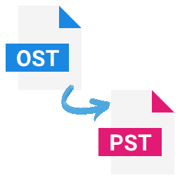
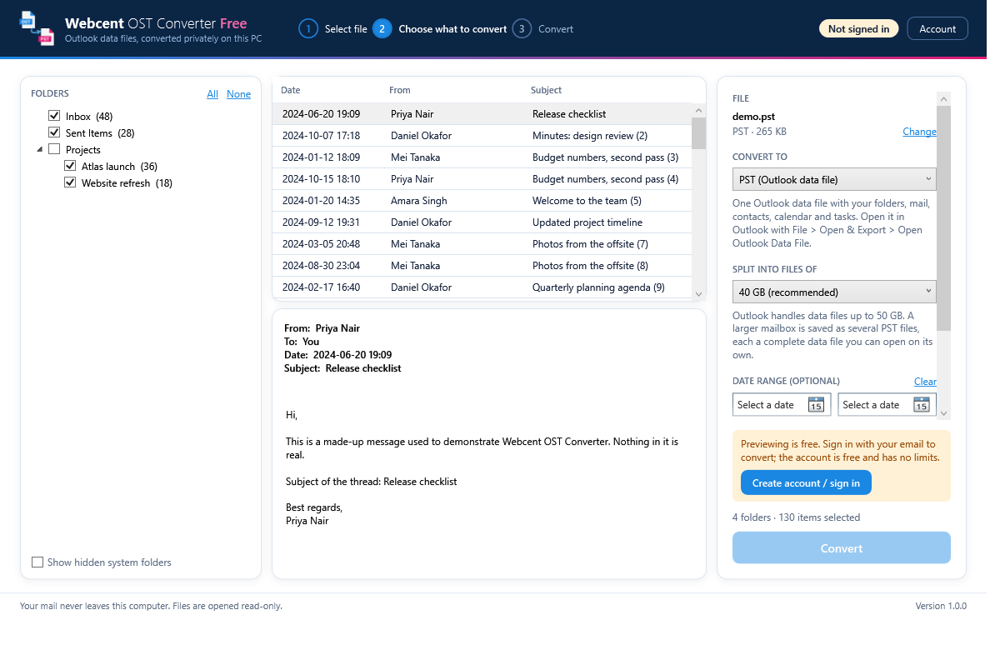

<p align="center">
  
</p>

<h1 align="center">Webcent OST Converter Free</h1>

<p align="center">
  Open an Outlook <b>OST</b> or <b>PST</b> file and save it as <b>PST, EML, MSG, MBOX, PDF, HTML or CSV</b>.<br>
  A native Windows app that works entirely on your PC: no Outlook needed, nothing uploaded, your file is never changed.
</p>

<p align="center">
  
</p>

## What it does

- **Reads OST and PST files directly.** A from-scratch reader for the Outlook data file format, written in C#, covering Unicode OST and PST files from Outlook 2003 onwards. Outlook does not have to be installed. (The old ANSI format of Outlook 97-2002 is not supported.)
- **Previews before you convert.** Browse the folder tree, scroll the messages and read them in the reading pane.
- **Converts to seven formats.** See the table below.
- **Handles large mailboxes.** Files are read lazily, a PST export is split into parts below a size you choose (default 40 GB, Outlook's limit is 50 GB), and damaged items are reported and skipped rather than stopping the job.
- **Keeps your mail private.** Conversion runs on your computer. The only thing the app sends over the network is your sign-in data (see [Privacy](#privacy)).

### Output formats

| Format | What you get | Notes |
| --- | --- | --- |
| **PST** | One Outlook data file with folders, mail, contacts, calendar and tasks | Opens in Outlook with *File > Open & Export > Open Outlook Data File*. Split into numbered parts above the size limit. |
| **EML** | One `.eml` file per message | Opens in Outlook, Thunderbird, Apple Mail and most other mail apps. |
| **MBOX** | One file per folder | For Thunderbird, Apple Mail and Gmail import tools. |
| **MSG** | One `.msg` file per message | Mail only. Double-click to open in Outlook. |
| **PDF** | One PDF per message | Header, attachment list and message text. HTML styling and images are not reproduced. |
| **HTML** | One web page per message, attachments saved beside it | |
| **CSV** | Mail index, contacts, calendar and tasks as spreadsheets | |

You can pick the folders to export and an optional date range.

## Free, with an account

Anyone can open and preview a file. To convert, create a free account: enter your name and email, then type the 6-digit code
we email you (no password). Converting then has no limits. One account works on 2 PCs.

## Install (Windows)

1. Download `WebcentOstConverterFree-win-Setup.exe` from the [releases page](../../releases) or from <https://webcents.in>.
2. Run it. It installs for the current user, no administrator rights needed, and adds a Start menu and desktop shortcut.
3. Open the app, drop an `.ost` or `.pst` file onto the window (or let it find the files already on your PC) and follow the three steps.

Requirements: Windows 10 or 11, 64-bit. Nothing else needs to be installed.

> The installer is not yet code-signed, so Windows SmartScreen may warn on first run ("More info" > "Run anyway").

More detail in the [user guide](docs/USER-GUIDE.md).

## Build from source

You need the [.NET 8 SDK](https://dotnet.microsoft.com/download) on Windows.

```powershell
# the app and its tests
dotnet test "OST Converter Free\OstConverterFree.sln" -c Release
dotnet run --project "OST Converter Free\src\OstConverterFree.App"

# the conversion engine and the command-line tool
dotnet test "OST Converter\OstConverter.Engine.sln" -c Release
```

No Outlook mailbox is needed to try it: the command-line tool can write a small mailbox of invented messages.

```powershell
dotnet run --project "OST Converter\src\OstConverter.Cli" -- demo demo.pst
```

See [docs/BUILDING.md](docs/BUILDING.md) for the full developer guide (tests, UI screenshots, icons, installer).

## Repository layout

```
assets/                    Logo, icons and screenshots
docs/                      User guide, architecture, building, PST writer notes
OST Converter/             The conversion engine and developer tools
  src/OstConverter.Core        reader, exporters, PST writer, conversion pipeline
  src/OstConverter.Cli         developer command-line tool (inspect, validate, demo data)
  tests/                       xUnit tests (all use generated files, no real mail)
  tools/                       icon generation and Outlook validation scripts
OST Converter Free/        The Windows app
  src/OstConverterFree.App       WPF user interface
  src/OstConverterFree.Accounts  sign-in client (offline-verified signed tokens)
  tests/                         xUnit tests
```

How the pieces fit together is described in [docs/ARCHITECTURE.md](docs/ARCHITECTURE.md).

## Privacy

Your mail is processed on your computer and never uploaded. The app contacts the Webcent account server only to sign you in,
refresh your sign-in about once a day and manage your devices, sending your name, email address, a device name and an anonymous
device identifier. Full details: [OST Converter Free/docs/PRIVACY.md](OST%20Converter%20Free/docs/PRIVACY.md).

## Status

Version 1.0 is the first release. The reader and the exporters are covered by automated tests, and the PST and MSG writers were additionally checked by opening their output in desktop Outlook (see [docs/PST-WRITER.md](docs/PST-WRITER.md)). Known limits:

- PDF output is text only; MSG output covers mail items, not contacts or calendar entries.
- ANSI files from Outlook 97-2002 cannot be opened.
- Items whose data is missing from the source file are exported as far as possible and listed in the conversion log.
- The account server that handles sign-in is operated by Webcent Solutions and is not part of this repository.

## Contributing and support

- Questions and problems: open an issue, or email <Info@webcents.in>. Please never attach real mail, OST or PST files.
- Security reports: see [SECURITY.md](SECURITY.md).
- Code contributions: see [CONTRIBUTING.md](CONTRIBUTING.md).

## Licence

Copyright (c) 2026 Webcent Solutions. All rights reserved. The source is published so that it can be read, audited and learned from; it is not open-source software. See [LICENSE](LICENSE) for what is and is not permitted, and the end-user terms in [OST Converter Free/docs/EULA.txt](OST%20Converter%20Free/docs/EULA.txt).

Third-party components and their licences are listed in [OST Converter Free/THIRD-PARTY-NOTICES.txt](OST%20Converter%20Free/THIRD-PARTY-NOTICES.txt).
